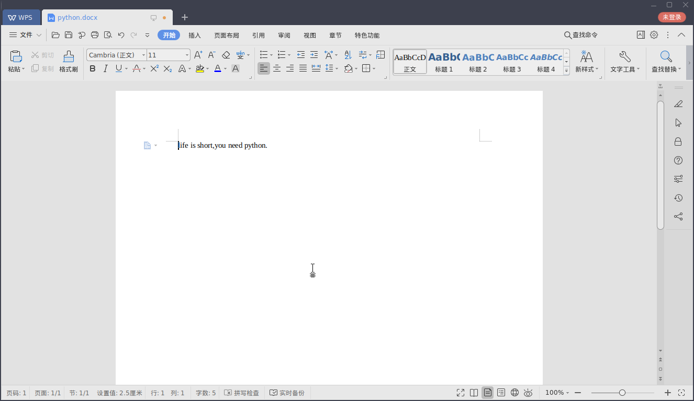
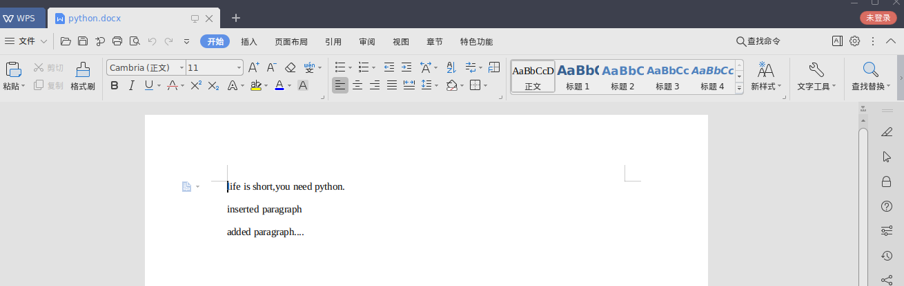
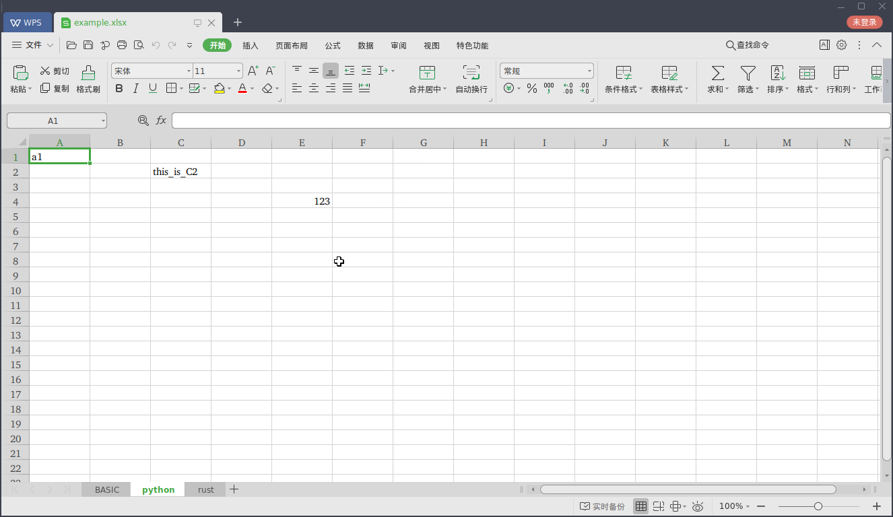
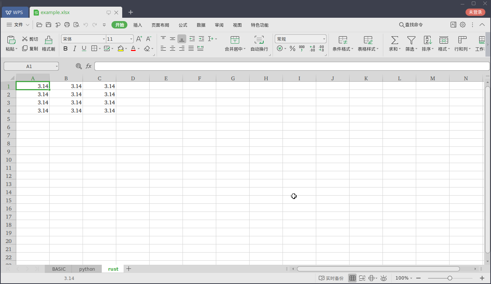
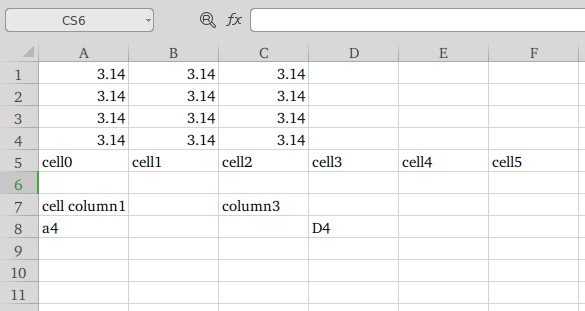
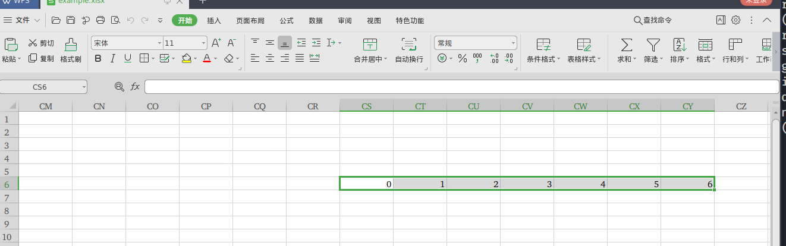
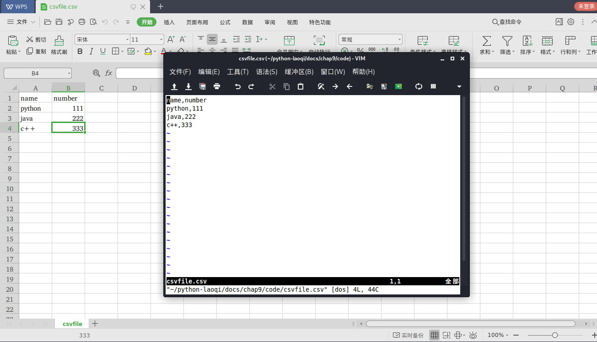

## [返回目录][catalogue]or[上一章][pre_chap]or[下一章][next_chap]
-----------------------------------------------------------------------------------


## 9.2 读写特定类型文件

+ 9.1节讲述了通用文本文件的读写操作，Python对某些常用的或者特定类型的文件还提供专门的读写操作支持
+ word,excel,csv


### 9.2.1 Word文档

+ 在Python生态环境中，Office中的每种文档都有相应的第三方包解决读写问题
+ 这里使用[python-docx](https://python-docx.readthedocs.io/en/latest/index.html)第三方包来操作Word文档

+ 安装python-docx包

```bash
pip install python-docx
```

+ 使用docx创建一个Word文件

```doctest
>>> from docx import Document
>>> d = Document()
>>> d.add_paragraph('life is short,you need python.')
<docx.text.paragraph.Paragraph object at 0x7f8e00c17400>
>>> d.save('python.docx')  #没有注明路径，会保存在当前目录中
```

+ 


+ 新增一个段落并插入一个段落

```doctest
>>> para = d.add_paragraph('added paragraph....')
>>> para.insert_paragraph_before('inserted paragraph')
<docx.text.paragraph.Paragraph object at 0x7f8e00b87340>
>>> d.save('python.docx')
```

+ 

+ 插入图片到Word文档中

```doctest
>>> d.add_picture('p2.png',width=docx.shared.Cm(4),height=docx.shared.Cm(6))
<docx.shape.InlineShape object at 0x7f8e00bb3be0>
>>> d.save('python.docx')
```
+ 

### 9.2.2 Excel文档

+ Excel文档通常是处理"数据"有关业务不可缺少的文档格式，(注意，不是大数据)
+ ***除了直接操作EXCEL文档，OpenPyXL还能够与数据分析的著名工具 NumPy,Pandas联合使用***
+ Python中有很多操作Excel的第三方包，此处仅以 [***OpenPyXL***](https://openpyxl.readthedocs.io/en/stable/index.html) 为例
	- XlsxWriter: <https://github.com/jmenamara/XlsxWriter>
	- xlwt: <https://pypi.org/project/xlwt/>
	- xkrd: <https://pypi.org/project/xlrd>

+ 使用pip安转OpenPyXL包
```bash
pip install openpyxl
```

+ 在内存中创建 ***工作簿(workbook)***

```doctest
>>> f>>> wb = Workbook()
>>> type(wb)
<class 'openpyxl.workbook.workbook.Workbook'>
>>> wb
<openpyxl.workbook.workbook.Workbook object at 0x7f0f0eda5e50>
```

+ 每个工作簿中至少有一个 ***工作表(worksheet)*** ，获取当前工作表
```doctest
>>> ws = wb.active
>>> ws
<Worksheet "Sheet">
>>> type(ws)
<class 'openpyxl.worksheet.worksheet.Worksheet'>
>>> ws.title
'Sheet'
```

+ 修改工作表的名称
```doctest
>>> ws.title = 'python'
>>> ws
<Worksheet "python">
>>> ws.title
'python'
```


+ 可以继续增加工作表
```dcotest
>>> help(wb.create_sheet)
Help on method create_sheet in module openpyxl.workbook.workbook:
create_sheet(title=None, index=None) method of openpyxl.workbook.workbook.Workbook instance
    Create a worksheet (at an optional index).
    
    :param title: optional title of the sheet
    :type tile: unicode
    :param index: optional position at which the sheet will be inserted
    :type index: int
(END)
>>> ws1 = wb.create_sheet('rust')   #在已有工作表ws后面追加新工作表 rust
>>> ws2 = wb.create_sheet('BASIC',0)  #在ws前面插入新工作表 BASIC
>>> wb.active
<Worksheet "BASIC">
>>> wb.sheetnames    #工作簿中所有工作表的名称和次序,工作表是从0开始索引的
['BASIC', 'python', 'rust']
>>> for sheet in wb:    #工作簿是可迭代对象 iterable
...     print(sheet)
... 
<Worksheet "BASIC">
<Worksheet "python">
<Worksheet "rust">
>>> ws3 = wb['python']  #worksheet名称可以作为workbook的key,得到该工作表
>>> ws3
<Worksheet "python">
>>> ws3 is ws
True
>>> wb.save('example.xlsx')
```

+ 


+ 单元格(cell)有行列组成，行索引从1开始，列索引从A开始，每个单元格用行列的索引标识
```doctest
>>> ws['e4']=123
>>> ws['e4']
<Cell 'python'.E4>
>>> ws['e4'].value
123
>>> type(ws['e4'])
<class 'openpyxl.cell.cell.Cell'>
```

+ worksheet的cell方法提供了按照函数形式写入数据的方法
```dcotest
cell(coordinate=None, row=None, column=None, value=None) method of openpyxl.worksheet.worksheet.Worksheet instance
    Returns a cell object based on the given coordinates.
    Usage: cell(row=15, column=1, value=5)
    Calling `cell` creates cells in memory when they
    are first accessed.
    :param row: row index of the cell (e.g. 4)
    :type row: int
    :param column: column index of the cell (e.g. 3)
    :type column: int
    :param coordinate: coordinates of the cell (e.g. 'B12')
    :type coordinate: string
    :param value: value of the cell (e.g. 5)
    :type value: numeric or time or string or bool or none
    :raise: InsufficientCoordinatesException when neither row nor column are not given
    :rtype: openpyxl.cell.Cell
(END)
>>> ws.cell(row=2,column=3,value='this_is_C2')
<Cell 'python'.C2>
>>> ws.cell(coordinate='A1',value='a1')
/usr/lib/python3/dist-packages/openpyxl/worksheet/worksheet.py:303: UserWarning: Using a coordinate with ws.cell is deprecated. Use ws[coordinate] instead
  warn("Using a coordinate with ws.cell is deprecated. Use ws[coordinate] instead")
<Cell 'python'.A1>
```

+ 


+ Excel中行和列都是从1开始计数的
```doctest
>>> for r in range(5):
...     for c in range(4):
...             ws1.cell(row=r,column=c,value=3.14)
... 
Traceback (most recent call last):
  File "<stdin>", line 3, in <module>
  File "/usr/lib/python3/dist-packages/openpyxl/worksheet/worksheet.py", line 307, in cell
    raise ValueError("Row or column values must be at least 1")
ValueError: Row or column values must be at least 1
>>> for r in range(1,5):
...     for c in range(1,4):
...             ws1.cell(row=r,column=c,value=3.14)
... 
<Cell 'rust'.A1>
<Cell 'rust'.B1>
<Cell 'rust'.C1>
<Cell 'rust'.A2>
<Cell 'rust'.B2>
<Cell 'rust'.C2>
<Cell 'rust'.A3>
<Cell 'rust'.B3>
<Cell 'rust'.C3>
<Cell 'rust'.A4>
<Cell 'rust'.B4>
<Cell 'rust'.C4>
>>> wb.save('example.xlsx')
```
+ 要将比较多的数据写入Excel表格中，可以使用循环语句



+ 还可以使用worksheet的append方法实现多行数据的写入

```doctest
>>> ws1.append('cell'+str(i) for i in range(6))
>>> ws1.append({k:v for k,v in zip(range(ord('a'),ord('h')),range(10))})
>>> ws1.append({1:'cell column1',3:'column3'})
>>> ws1.append({'a':'a4','d':'D4'})
>>> ws1
<Worksheet "rust">
>>> wb.save('example.xlsx')
>>> {k:v for k,v in zip(range(ord('a'),ord('h')),range(10))}
{97: 0, 98: 1, 99: 2, 100: 3, 101: 4, 102: 5, 103: 6}
>>> ws1.append({chr(k):v for k,v in zip(range(ord('a'),ord('h')),range(10))})
>>> wb.save('example.xlsx')
```

   


### 9.2.3 CSV文档

+ CSV:即Comma-Separated Values,"逗号分割值"，其文件以纯文本形式存储表格数据
+ 所有的CSV文件也可以用电子表格软件打开
+ 但是CSV文档和Excel文档有很多不同之处
	- CSV文档中的值没有类型，所有值都是字符串
	- CSV不能进行图文编辑，因为它是一个纯文本文件
+ 在Python的标准库中有专门操作CSV文档的模块 [CSV 文件读写](https://docs.python.org/zh-cn/3/library/csv.html)
+ CSV文档的创建和内容的写入操作
```doctest
>>> import csv
>>> datas = [['name','number'],['python','111'],['java',222],['c++',333]]
>>> with open('csvfile.csv','w') as f:
...     writer = csv.writer(f)
...     writer.writerows(datas)
```

+ 


+ 在Python读取CSV文件的内容
```
>>> f = open('csvfile.csv')
>>> reader = csv.reader(f)
>>> for row in reader:
...     print(row)
... 
['name', 'number']
['python', '111']
['java', '222']
['c++', '333']
>>> f.tell()
44
>>> f.seek(0)
>>> f.tell()
0
>>> for line in f:
...     print(line)
... 
name,number

python,111

java,222

c++,333

>>> 
```


-----------------------------------------------------------------------------------
## [返回目录][catalogue]or[上一章][pre_chap]or[下一章][next_chap]
[pre_chap]: 2021-01-21-chap0.md
[next_chap]: 2021-01-21-chap2.md
[catalogue]: 2021-01-21-catalogue.md
