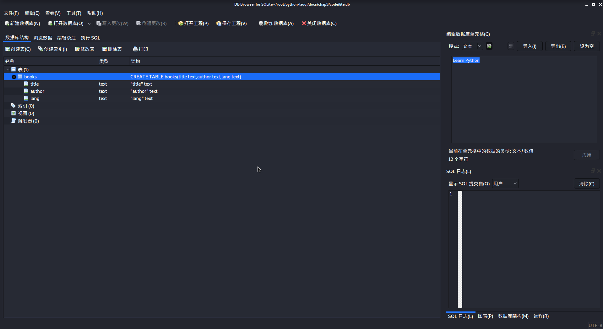
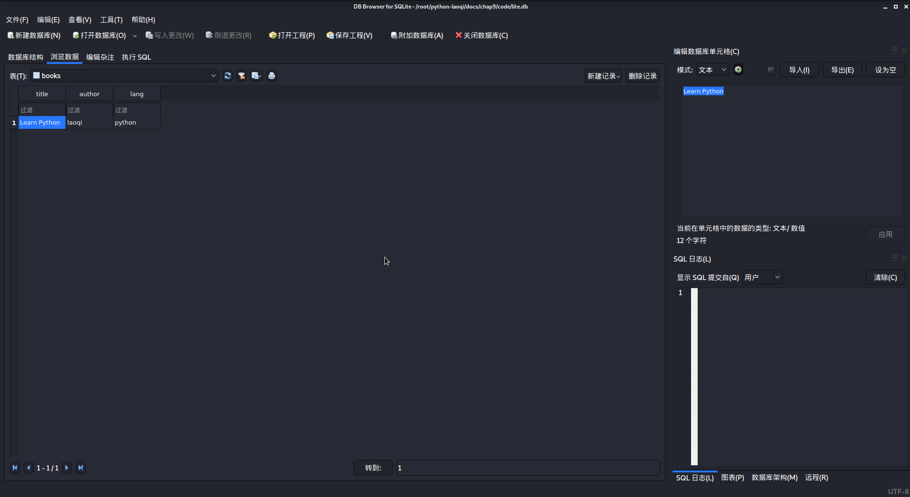

## [返回目录][catalogue]or[上一章][pre_chap]or[下一章][next_chap]
-----------------------------------------------------------------------------------


## 9.3 将数据存入文件(Data Persistance)


+ 在某种情况下，将数据保存到一般的文件(如文本文件)，或者某种特定类型的文件(word,excel,csv),能够满足需求
+ 但上述保存数据的文件不具有特定的格式，不利于读取和优化存储
+ 下面几种专门保存数据的方式，都具有将对象序列化(object serialization)存储的特点

### 9.3.1 pickle

+ [pickle](https://docs.python.org/zh-cn/3/library/pickle.html)实现了对一个Python对象结构的二进制序列化和反序列化
+ 使用pickle实现简单的数据保存

```doctest
>>> import pickle
>>> integer = 123
>>> s1 = 'string'
>>> s2 = s1
>>> f = open('pickledata.data','wb+')
>>> pickle.dump(integer,f)
>>> pickle.dump(s1,f)
>>> pickle.dump(s2,f)
>>> pickle.dump((s1,s2),f)
>>> pickle.dumps(integer)
b'\x80\x04K{.'
>>> pickle.dumps(s1)
b'\x80\x04\x95\n\x00\x00\x00\x00\x00\x00\x00\x8c\x06string\x94.'
```


+ 以上完成了数据写入，即 ***序列化*** 过程，它的反过程就是读取，即 ***反序列化***


```doctest
>>> i = pickle.dumps(integer)
>>> s = pickle.dumps(s1)
>>> pickle.loads(i)
123
>>> pickle.loads(s)
'string'
>>> def getdata(f):
...     f.seek(0)
...     while True:
...             if len(f.peek()) == 0:
...                     break
...             r = pickle.load(f)
...             yield r
... 
>>> 
>>> 
>>> data = list(getdata(f))
>>> data
[123, 'string', 'string', ('string', 'string')]
>>> for i in data:
...     id(i)
... 
140688767793328
140688762893552
140688762697392
140688762505856
>>> id(data[-1][0])
140688762478704
>>> id(data[-1][1])
140688762478704
```


### 9.3.2 shelve

+ shelve是Python标准库中的一员，相对于pickle，它能完成结构更复杂一些的数据读写操作
+ **shelve.Shelf** 是一种持久化的类似字典的对象
	- 其 **值Value** 可以为任意Python对象(pickle模块能够处理的任何东西)
	- **键Key** 为普通字符串
+ 使用shelve完成数据持久化

```doctest
>>> import shelve
>>> s = shelve.open('shelvedata') #不需要说明打开模式
>>> s['name'] = 'shelvedatabase'
>>> s['lang'] = 'python'
>>> s['pages'] = '225'
>>> s['index'] = {'chapter1':'About programing language','chapter2':'About Python'}
>>> s.close()
```

+ 使用类似字典方式获取数据

```doctest
>>> rs = shelve.open('shelvedata')
>>> rs['name']
'shelvedatabase'
>>> for k in rs:
...     print(k,rs[k])
... 
index {'chapter1': 'About programing language', 'chapter2': 'About Python'}
lang python
pages 225
name shelvedatabase
```


+ 注意:`writeback`参数的作用
+ `writeback=True` 会占用更多内存，读写速度降低，要根据实际情况权衡是否使用

```doctest
>>> rs['lang'] = ['python']
>>> list(rs.items())
[('index', {'chapter1': 'About programing language', 'chapter2': 'About Python'}), ('lang', ['python']), ('pages', '225'), ('name', 'shelvedatabase')]
>>> rs['lang'].append('php')
>>> list(rs.items())
[('index', {'chapter1': 'About programing language', 'chapter2': 'About Python'}), ('lang', ['python']), ('pages', '225'), ('name', 'shelvedatabase')]
>>> rs.writeback
False
>>> rs.writeback = True
>>> rs['lang'].append('php')
>>> list(rs.items())
[('index', {'chapter1': 'About programing language', 'chapter2': 'About Python'}), ('lang', ['python', 'php']), ('pages', '225'), ('name', 'shelvedatabase')]
>>> rs.close()
>>> ts = shelve.open('shelvedata',writeback=True)
>>> ts['lang'].append('java')
>>> list(ts.items())
[('index', {'chapter1': 'About programing language', 'chapter2': 'About Python'}), ('lang', ['python', 'php', 'java']), ('pages', '225'), ('name', 'shelvedatabase')]
```


+ pickle 和 shelve,都能实现数据的存储和读取，但2者毕竟不是数据库，通常不支持大量数据的存储和频繁的读取


### 9.3.3 SQLite 数据库

+ SQLite是一个小型的关系数据库,特别是在与终端应用配合上，用途广泛
+ 最大的特点在于: 不需要单独的服务，零配置
+ Python已经将相应的驱动模块作为了标准库的一部分，可以像操作文件那样操作SQLite数据库文件
+ SQLite源码不受版权限制
+ 在开发实践中所用到的数据库，特别是网站开发中，一般比SQLite更复杂
	- 如PostgreSQL,MySQL等
	- 除了关系型数据库，还有非关系型数据库，如MongoDB等


+ 使用 `sqlite3.connect(database)`打开数据库，默认返回`Connection`对象(':memory:',在内存中打开一个数据库)
+ 如果数据库文件存在就连接上，否则自动创建


```doctest
>>> import sqlite3
>>> con = sqlite3.connect('lite.db')
```


+ 对于数据库而言，建立了数据库连接对象`Connection`后，还要建立游标对象`Cursor`,通过游标对象实现对数据库的 增删改查 等操作


```doctest
>>> cur = con.cursor()
>>> con
<sqlite3.Connection object at 0x7f368837f8a0>
>>> cur
<sqlite3.Cursor object at 0x7f3688375a40>
```

+ cur引用的是游标对象，接下来对数据库内容的操作都是用游标对象的方法来实现的
+ 操作关系型数据库离不开SQL指令:SQL是专门用于管理关系型数据库的一种程序语言，不同的关系型数据库的SQL实现略有不同，但基本语法是相通的

+ 数据库的结构类似Excel中工作表的结构


Excel		|Relational DataBase
----------------|-------------------
workbook	|database
worksheet	|table
row		|record
column		|field


+ 首先为`con`连接的数据库创建table

+ `create_table` 以字符串的形式写了一条创建表的SQL语句
	- 意思是创建名为 `books`的表
	- 其字段(field，即 列)分别为 `title,author,lang`
	- 并规定了字段类型为 `text,text,text`
+ 游标的`execute(sql[,parameters])`方法可以执行任何SQL语句


```doctest
>>> create_table = '''create table books(title text,author text,lang text)'''
>>> cur.execute(create_table)
<sqlite3.Cursor object at 0x7f3c11bc2030>
```


+ 接下来对这个表增加数据，即添加记录('insert into' sql 语句)
+ 必须完成`commit()`操作，才会将修改的数据真正保存到数据库
+ 在退出之前要分别将游标对象`cur`和连接对象`con`关闭


```doctest
>>> insert_record = '''insert into books values('Learn Python','laoqi','python')'''
>>> insert_record
"insert into books values('Learn Python','laoqi','python')"
>>> cur.execute(insert_record)
<sqlite3.Cursor object at 0x7f3c11bc2030>
>>> con.commit()
>>> cur.close()
>>> con.close()
```

+ 可以使用kali自带的`DB Browser for SQLite`软件打开当前已经创建的数据库





+ 从上图中可以分别看到[数据库中有哪些表，和表books的结构],[以及数据库表books的数据]

+ 在工具软件中查询，还不能将查询结果在程序中直接使用
+ 要在程序中实现查询必须使用SQL指令
	- 'SELECT' 指令查询数据库中的数据
	- `Cursor.fetchall()`方法返回所有的查询结果


```doctest
>>> con = sqlite3.connect('lite.db')
>>> cur = con.cursor()
>>> cur.execute('select * from books')
<sqlite3.Cursor object at 0x7f3c11bc2260>
>>> cur.fetchall()
[('Learn Python', 'laoqi', 'python')]
```

+ 还可以使用`INSERT INTO`增加记录
+ `Cursor.executemany(sql,seq_of_params)`基于序列`seq_of_params`中找到的所有形参序列或映射执行一条SQL命令
+ `Cursor.executescript(sql_script)`可用于一次执行多条SQL语句
	- 它会首先执行一条 `COMMIT` 语句，再执行以形参方式获取的 SQL 脚本。

```doctest
>>> books = [(f+' book',f,c) for f,c in zip(('first','second','third'),('c','c','python'))]
>>> 
>>> books
[('first book', 'first', 'c'), ('second book', 'second', 'c'), ('third book', 'third', 'python')]
>>> cur.executemany('insert into books values(?,?,?)',books)
<sqlite3.Cursor object at 0x7f3c11bc2260>
>>> con.commit()
>>> cur.execute('select * from books')
<sqlite3.Cursor object at 0x7f3c11bc2260>
>>> cur.fetchall()
[('Learn Python', 'laoqi', 'python'), ('first book', 'first', 'c'), ('second book', 'second', 'c'), ('third book', 'third', 'python')]
```


+ 使用`Cursor.execute()`方法和SQL指令，还可以实现对记录的更新修改
+ `WHERE`子句限定条件查找记录
+ 如果确认只有一条返回结果或者只要一条返回结果，可以使用`Cursor.fetchone()`方法
+ `Cursor.fetchmany(size=cursor.arraysize)`返回少于等于size条记录的结果集


```doctest
>>> cur.arraysize
1
>>> cur.execute('''update books set title='PHYSICS' where author='first' ''')
<sqlite3.Cursor object at 0x7f3c11bc2260>
>>> con.commit()
>>> cur.execute('''select * from books where author='first' ''')
<sqlite3.Cursor object at 0x7f3c11bc2260>
>>> cur.fetchone()
('PHYSICS', 'first', 'c')
>>> cur.execute('select * from books')
<sqlite3.Cursor object at 0x7f3c11bc2260>
>>> cur.fetchmany(3)
[('Learn Python', 'laoqi', 'python'), ('PHYSICS', 'first', 'c'), ('second book', 'second', 'c')]
>>> cur.fetchmany(3)
[('third book', 'third', 'python')]
```


+ 最后，对数据库记录的删除操作也是SQL中常用到的
+ `rollback()` 这个方法回滚从上一次调用 commit() 以来所有数据库的改变。

```doctest
>>> cur.execute('''delete from books where author='second' ''')
<sqlite3.Cursor object at 0x7f3c11bc2260>
>>> cur.execute('select * from books')
<sqlite3.Cursor object at 0x7f3c11bc2260>
>>> cur.fetchall()
[('Learn Python', 'laoqi', 'python'), ('PHYSICS', 'first', 'c'), ('third book', 'third', 'python')]
>>> con.commit()
>>> cur.execute('''delete from books ''')
<sqlite3.Cursor object at 0x7f3c11bc2260>
>>> cur.execute('select * from books')
<sqlite3.Cursor object at 0x7f3c11bc2260>
>>> cur.fetchall()
[]
>>> cur.execute('select * from books')
<sqlite3.Cursor object at 0x7f3c11bc2260>
>>> con.rollback()
>>> cur.fetchall()
[('Learn Python', 'laoqi', 'python'), ('PHYSICS', 'first', 'c'), ('third book', 'third', 'python')]
```


-----------------------------------------------------------------------------------
## [返回目录][catalogue]or[上一章][pre_chap]or[下一章][next_chap]
[pre_chap]: 2021-01-21-chap0.md
[next_chap]: 2021-01-21-chap2.md
[catalogue]: 2021-01-21-catalogue.md
